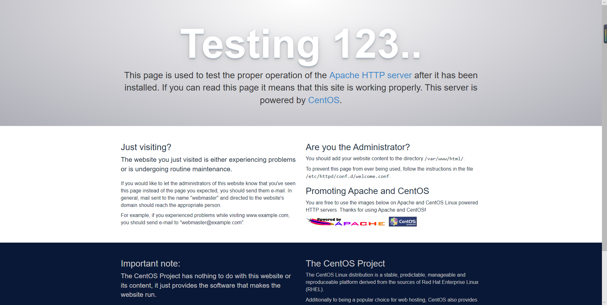

# 腾讯云CentOS 7上搭建WordPress

# 前提
#### 购买腾讯云服务器实例（包含独立的域名并实名认证）

# 部署环境：LAMP
- 云操作系统：CentOS 7.2 64位；
- HTTP服务器：Apache Web 服务器；
- 数据库：MySQL；
- 建站工具：WordPress（基于PHP）。

# 步骤

# 1.安装Apache Web服务器
#### 使用yum工具安装：
	sudo yum install httpd

#### 安装完成之后，启动Apache Web服务器
	sudo systemctl start httpd.service

#### 测试Apache服务器是否成功运行，找到腾讯云实例的公有IP地址(your_cvm_ip)，在你本地主机的浏览器上输入：
	http://your_cvm_ip/




# 2.安装MySQL
#### 安装MariaDB：
	sudo yum install mariadb-server mariadb


#### 安装好之后，启动mariadb：
	sudo systemctl start mariadb
	sudo mysql_secure_installation
	sudo systemctl enable mariadb.service




# 3.安装PHP
        sudo yum install epel-release yum-utils
        sudo yum install http://rpms.remirepo.net/enterprise/remi-release-7.rpm
		sudo yum-config-manager --enable remi-php72
		sudo yum install php php-mysql
		php -v
		sudo systemctl restart httpd.service



# 安装PHP模块

#### 启动PHP附加模块，使用如下命令：
	yum search php-


#### 重启Apache服务：
	sudo service httpd restart


### 至此，LAMP环境已经安装成功，接下来测试PHP。


# 4.测试PHP
#### 创建info.php并将其置于Web服务的根目录（/var/www/html/）：
	sudo service httpd restart

#### 添加如下内容：
	<?php phpinfo(); ?>

#### 在你的本地主机的浏览器中输入:
	http://your_cvm_ip/info.php



# 5.安装WordPress以及完成相关配置
##( 1)为WordPress创建一个MySQL数据库

#### 首先以root用户登录MySQL数据库：
	mysql -u root -p

#### 为WordPress创建一个新的数据库：
	CREATE DATABASE wordpress;

#### 为WordPress创建一个独立的MySQL用户：
	CREATE USER wordpressuser@localhost IDENTIFIED BY 'password';

#### 使用你自定义的用户名和密码。授权给wordpressuser用户访问数据库的权限：
	GRANT ALL PRIVILEGES ON wordpress.* TO wordpressuser@localhost IDENTIFIED BY 'pa

#### 刷新MySQL的权限：
	FLUSH PRIVILEGES;

#### 退出MySQL的命令行模式：
	exit


## (2)安装WordPress
#### 下载WordPress至当前用户的主目录：
	cd ~
	wget http://wordpress.org/latest.tar.gz

#### wget命令从WordPress官方网站下载最新的WordPress集成压缩包，解压该文件：
	tar xzvf latest.tar.gz

#### 将该文件夹下的内容同步到Apache服务器的根目录下，使得wordpress的内容能够被访问
	sudo rsync -avP ~/wordpress/ /var/www/html/

#### 在Apache服务器目录下为wordpress创建一个文件夹来保存上传的文件：
	mkdir /var/www/html/wp-content/uploads

#### 对Apache服务器的目录以及wordpress相关文件夹设置访问权限：
	sudo chown -R apache:apache /var/www/html/*


## (3)配置WordPress
#### 通过命令行连接WordPress和MySQL定位到wordpress所在文件夹：
	cd /var/www/html

#### WordPress的配置依赖于wp-config.php文件,通过拷贝wp-config-sample.php文件来生成：
	cp wp-config-sample.php wp-config.php

#### 通过nano超简单文本编辑器来修改配置，主要是MySQL相关配置：
	nano wp-config.php


## (4)通过Web界面进一步配置WordPress
#### 通过WordPress提供的Web页面进一步配置。输入你的IP地址或者域名：
	http://server_domain_name_or_IP


#### 设置网站的标题，用户名和密码以及电子邮件等，点击Install WordPress，弹出确认页面：


#### 点击Log In，弹出登录界面：


#### 输入用户名和密码之后，进入WordPress的控制面板：


