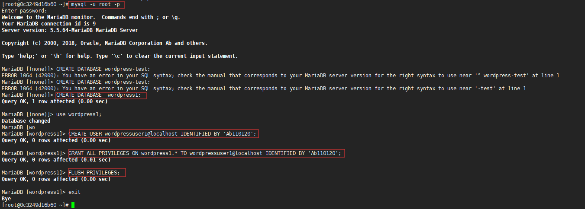

# **Docker基础实验**

------------


# 实验一：安装Docker


## 1.首先更新应用程序数据库：
### 使用yum工具安装：
     yum check-update


## 2.下载最新的Docker并安装：
### 安装 Docker Engine-Community：

### 安装所需的软件包:
      yum install -y yum-utils \
      device-mapper-persistent-data \
      lvm2

### 使用以下命令来设置稳定的仓库：

      yum-config-manager \
      --add-repo \
      https://download.docker.com/linux/centos/docker-ce.repo


### 安装最新版本的 Docker Engine-Community 和 containerd
     yum install docker-ce docker-ce-cli containerd.io  


### 安装完成之后启动Docker守护进程，即Docker服务：
     systemctl start docker


### 验证Docker是否成功启动：
      systemctl status docker


### 最后，确保Docker当服务器启动时自启动：
     systemctl enable docker


### 此外，还可以查看一下Docker的版本信息：
     docker version


# 实验二：完成Docker安装之后加载CentOS镜像
## 加载Docker镜像

### 使用search命令查询Docker Hub中的可用镜像
     docker search centos


### 接下来拉取centos:7镜像：
     docker pull centos:7


### 查看一下当前系统中存在的镜像：
     docker images


# 实验二：在Docker的CentOS容器实例中安装WordPress
## 1.运行Docker容器
### 以上述的CentOS镜像为例运行其容器，并使用端口映射：
     docker run -d -it --privileged --name test -p 8888:80 -d centos:7 /usr/sbin/init
     docker exec -it test /bin/bash


## 2.搭建WordPress
### 1.安装Apache Web服务器
#### 使用yum工具安装：
     yum install httpd

#### 安装完成之后，启动Apache Web服务器：
     systemctl start httpd.service

#### 在你本地主机的浏览器上输入：
     http://106.54.102.87:8888


### 2.安装MySQL
#### 安装MariaDB：
     yum install mariadb-server mariadb

#### 安装好之后，启动mariadb：
     systemctl start mariadb

#### 启动交互脚本：
     mysql_secure_installation


#### 设置开机启动MariaDB：
     systemctl enable mariadb.service

### 3.安装PHP
      yum install epel-release yum-utils
      yum install http://rpms.remirepo.net/enterprise/remi-release-7.rpm
      yum-config-manager --enable remi-php72
      yum install php php-mysql
      php -v
      systemctl restart httpd.service


### 4.测试PHP
#### 创建info.php并将其置于Web服务的根目录（/var/www/html/）：
	sudo service httpd restart

#### 添加如下内容：
	<?php phpinfo(); ?>

#### 在你的本地主机的浏览器中输入:
	http:106.54.102.87:8888.info.php


### 5.安装WordPress以及完成相关配置
#### ( 1)为WordPress创建一个MySQL数据库

#### 首先以root用户登录MySQL数据库：
	mysql -u root -p

#### 为WordPress创建一个新的数据库：
	CREATE DATABASE wordpress;

#### 为WordPress创建一个独立的MySQL用户：
	CREATE USER wordpressuser@localhost IDENTIFIED BY 'password';

#### 使用你自定义的用户名和密码。授权给wordpressuser用户访问数据库的权限：
	GRANT ALL PRIVILEGES ON wordpress.* TO wordpressuser@localhost IDENTIFIED BY 'pa

#### 刷新MySQL的权限：
	FLUSH PRIVILEGES;

#### 退出MySQL的命令行模式：
	exit


#### (2)安装WordPress
#### 下载WordPress至当前用户的主目录：
	cd ~
	wget http://wordpress.org/latest.tar.gz
#### wget命令从WordPress官方网站下载最新的WordPress集成压缩包，解压该文件：
	tar xzvf latest.tar.gz

#### 将该文件夹下的内容同步到Apache服务器的根目录下，使得wordpress的内容能够被访问
	sudo rsync -avP ~/wordpress/ /var/www/html/

#### 在Apache服务器目录下为wordpress创建一个文件夹来保存上传的文件：
	mkdir /var/www/html/wp-content/uploads

#### 对Apache服务器的目录以及wordpress相关文件夹设置访问权限：
	sudo chown -R apache:apache /var/www/html/*


#### (3)配置WordPress
#### 通过访问公网ip:8888配置wordpress
	http://106.54.102.87:8888/

#### 填写先前创建的数据库名，用户名及密码：


#### 设置网站的标题，用户名和密码以及电子邮件等，点击Install WordPress，弹出确认页面：


#### (4)登录wordpress，编辑个人博客


# 实验二：创建新的镜像
### 1.首先使用如下命令查看本地中的容器：
     docker ps -a


### 使用commit命令来提交更改到新的镜像中，即创建新的镜像
     docker commit -m “install apache server” -a “ll” 00123e32a83c centos:apache_web

### 2.再次使用镜像查看命令：
     docker images


### 3.为新建的镜像打上标签（Tag）
     docker tag 3e46de335eeb docker-hub-username/centos:apache_web

### 4.完成之后，同样查看已存在的镜像：
     docker images


# 实验三：将带有WordPress的CentOS镜像推送到容器仓库

### 1.首先要到Docker Hub上进行注册，然后使用shell登录：
     docker login -u docker-hub-username


### 2.使用如下命令推送新创建的镜像：
     docker push docker-hub-username/docker-image-name


## 登陆Docker Hub，查看Repository


# **实验三：使用dockerfile搭建wordpress**

------------
##  1.创建一个文件夹存放dockerfile及所需文件

###  文件夹中需要存放如下文件：

### dockerfile、 setup.sh 、setup.sql 、wordpress压缩包


## 2.编写dockerfile


## 3.编写数据库文件setup.sql


## 4.编写脚本文件setup.sh


## 5.建立镜像

```
docker build -t tt11 .
```


## 6.创建容器,启用端口8080，并以特权模式运行，并启动httpd

```
docker run -d -it --privileged --name ts99 -p 8080:80 -d tt11 /usr/sbin/init 
```


## 7.查看docker进程


## 8.浏览器进入http://106.54.102.87:8080 ，查看是否配置成功


