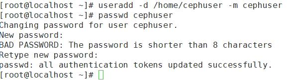
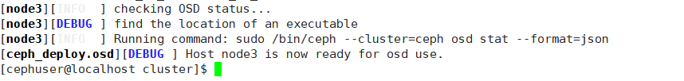

# **Ceph的安装与实践** 

## 步骤1-创建ceph-node节点

### 1.最小化安装centos7


### 2.打开网卡

```
vi /etc/sysconfig/network-scripts/ifcfg-ens33
```

###### 将onboot 的值改为 yes， 重启


### 3.创建一个Ceph用户

```
useradd -d /home/cephuser -m cephuser
passwd cephuser
```



```
echo "cephuser ALL = (root) NOPASSWD:ALL" | sudo tee /etc/sudoers.d/cephuser
chmod 0440 /etc/sudoers.d/cephuser
sed -i s'/Defaults requiretty/#Defaults requiretty'/g /etc/sudoers
```


### 4.安装和配置NTP

##### 安装NTP以同步所有节点上的日期和时间。运行ntpdate命令通过NTP协议设置日期和时间，我们将使用us pool NTP服务器。然后启动并启用NTP服务器在引导时运行。

```
yum install -y ntp ntpdate ntp-doc
ntpdate 0.us.pool.ntp.org
hwclock --systohc
systemctl enable ntpd.service
systemctl start ntpd.service
```


### 5.安装Open-vm-tools

```
yum install -y open-vm-tools
```


### 6.禁用SELinux

```
sed -i 's/SELINUX=enforcing/SELINUX=disabled/g' /etc/selinux/config
```


## 步骤二-创建并配置其余节点

### 7.克隆镜像，生成3个新的节点

节点ip分别为

admin-node 192.168.253.130

node 1  192.168.253.134

node 2  192.168.253.132

node 3  192.168.253.133


### 8.admin-node配置host文件

```
vim /etc/hosts
```


### 9.测试网络连通


### 10.ceph-admin节点配置ssh服务

登录到**ceph** -admin节点并成为“ **cephuser** ”

```
ssh root@ceph-admin
su - cephuser
ssh-keygen
```

为“ **cephuser** ” 生成ssh密钥

```
ssh-keygen
```

为ssh配置创建配置文件

```
vim ~/.ssh/config
```

粘贴以下配置：

```
Host ceph-admin
        Hostname ceph-admin
        User cephuser
 
Host node1
        Hostname node1
        User cephuser
 
Host node2
        Hostname node2
        User cephuser
 
Host node3
        Hostname node3
        User cephuser
```


### 11.使用ssh-copy-id命令将SSH密钥添加到所有节点。

```
ssh-keyscan node1 node2 node3 >> ~/.ssh/known_hosts
ssh-copy-id node1
ssh-copy-id node2
ssh-copy-id node3

```


### 12.尝试从ceph-admin节点访问node1服务器

```
ssh node1
```


### 13.配置防火墙

登录到ceph-admin节点并启动firewalld

```
ssh root@ceph-admin
systemctl start firewalld
systemctl enable firewalld

ssh node1
sudo systemctl start firewalld
sudo systemctl enable firewalld
```

打开端口80、2003和4505-4506，然后重新加载防火墙。

```
sudo firewall-cmd --zone=public --add-port=80/tcp --permanent
sudo firewall-cmd --zone=public --add-port=2003/tcp --permanent
sudo firewall-cmd --zone=public --add-port=4505-4506/tcp --permanent
sudo firewall-cmd --reload
```

从ceph-admin节点登录到监视节点“ mon1”，然后启动firewalld。

```
sudo firewall-cmd --zone=public --add-port=6789/tcp --permanent
sudo firewall-cmd --reload
```

从ceph-admin节点登录到每个osd节点。

```
ssh node2
sudo systemctl start firewalld
sudo systemctl enable firewalld
sudo firewall-cmd --zone=public --add-port=6800-7300/tcp --permanent
sudo firewall-cmd --reload
```


## 步骤三-构建Ceph集群

### 14.在ceph-admin节点上安装ceph-deploy

```
sudo rpm -Uhv http://download.ceph.com/rpm-jewel/el7/noarch/ceph-release-1-1.el7.noarch.rpm
sudo yum update -y && sudo yum install ceph-deploy -y
```


### 15.创建新的集群配置

创建新的群集目录。

```
mkdir cluster
cd cluster/
```

使用“ **ceph** **-deploy** ”命令创建一个新的集群配置，将监视节点定义为“ **node1** ”。

```
ceph-deploy new node1
```

用vim编辑ceph.conf文件,在[global]块下，在下面粘贴配置。

```
# Your network address
public network = 10.0.15.0/24
osd pool default size = 2
```


### 16.在所有节点上安装Ceph

```
ceph-deploy install  node1 node2 node 3
```

将ceph-mon部署在node1节点上

```
ceph-deploy mon create-initial
ceph-deploy gatherkeys node1
```


### 17.将OSDS添加到群集

检查/ dev / sda1分区在所有OSD节点上是否可用。

```
ceph-deploy disk list osd1 osd2 osd3
```


准备所有OSDS节点。确保结果中没有错误。

```
ceph-deploy osd prepare node2:/dev/sda11 node3:/dev/sda1
```




使用以下命令激活OSD：

```
ceph-deploy osd activate node2:/dev/sda11 node3:/dev/sda11
```


### 18.将管理密钥部署到所有关联的节点

```
ceph-deploy admin ceph-node node1 node2 node3
```


通过在所有节点上运行以下命令来更改密钥文件的权限

```
sudo chmod 644 /etc/ceph/ceph.client.admin.keyring
```


## 步骤四-测试Ceph设置

### 19.从**ceph** -admin节点登录到**ceph**监视服务器“ **node1** ”

```
ssh node1
```

### 20.检查集群运行状况和集群状态

```
sudo ceph health
sudo ceph -s
```

### 


